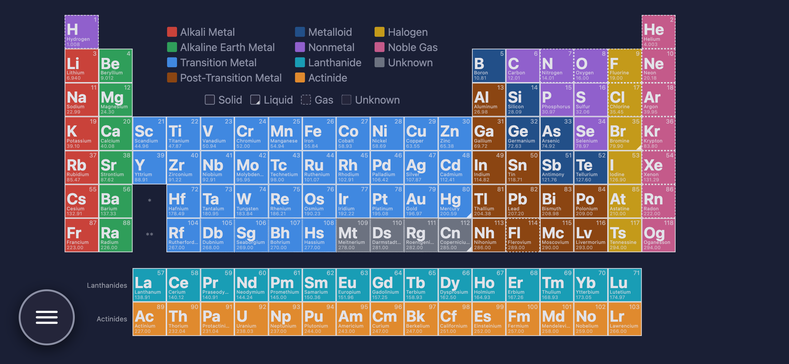
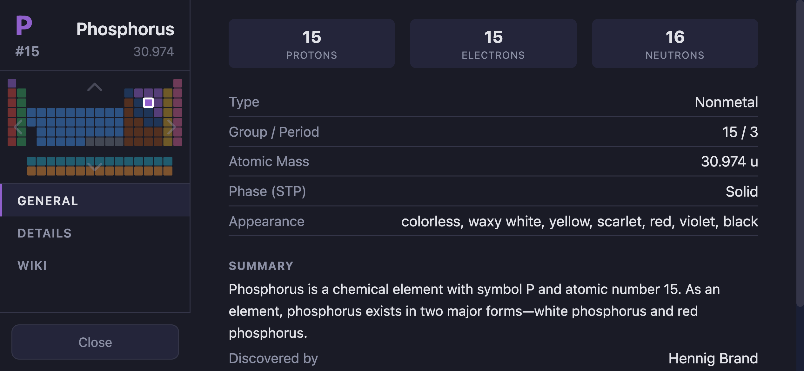
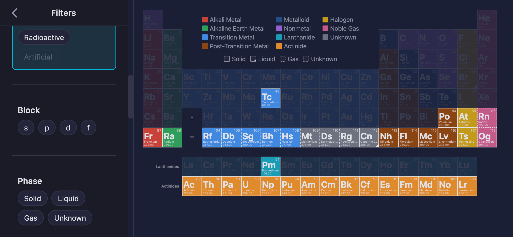
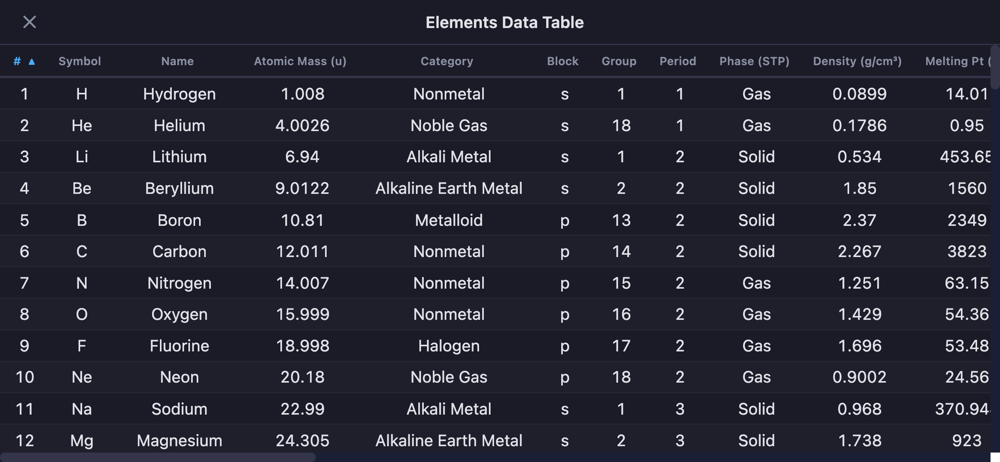
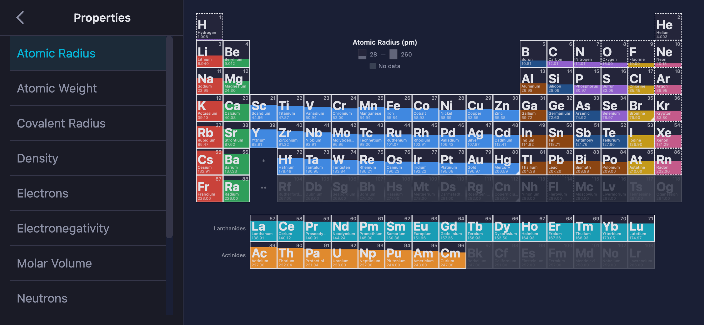
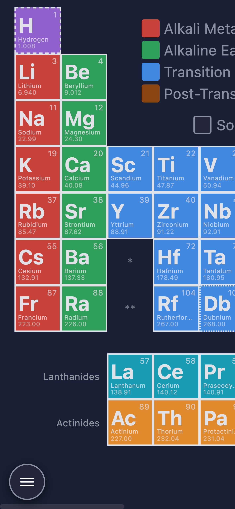
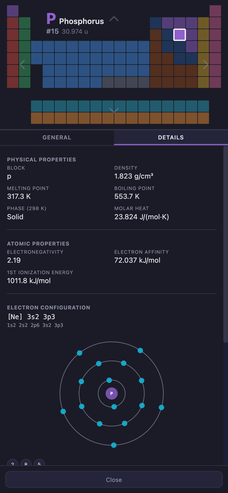
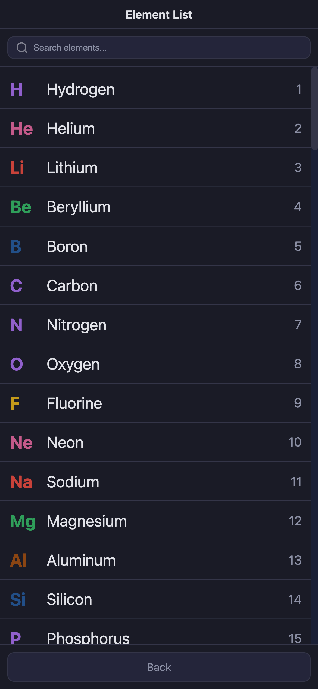
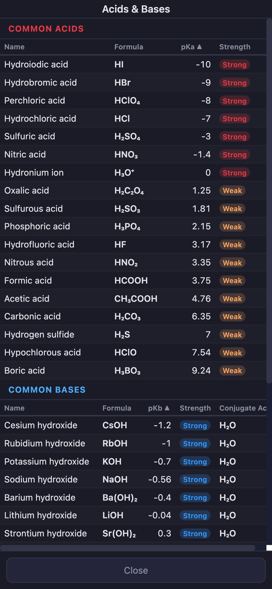
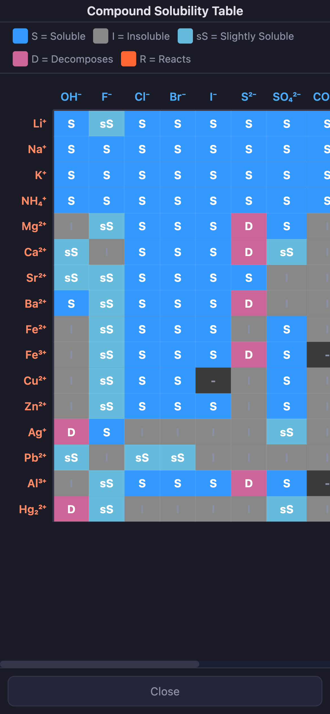

# POC Periodic Table

An interactive periodic table built with SvelteKit and Svelte 5.

## Screenshots

### Desktop











### Mobile

| Table View | Element Details | Element List |
|:---:|:---:|:---:|
|  |  |  |

| Acids & Bases | Solubility Table |
|:---:|:---:|
|  |  |

## Developing

```sh
npm install
npm run dev
```

## Building

```sh
npm run build
```

Preview the production build with `npm run preview`.
